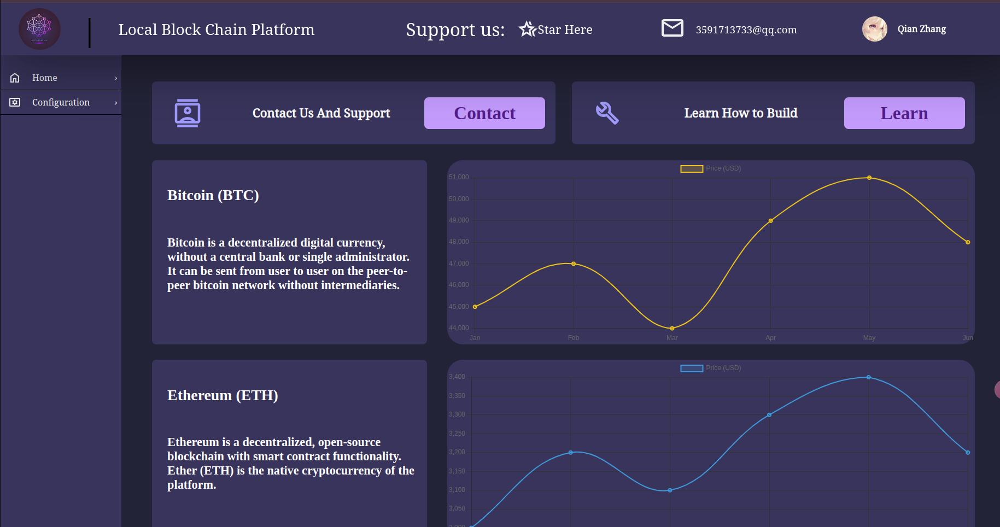

# 本地区块链系统

## 一、为什么要做这个系统

在本人学习区块链相关技术时，时常因为缺少难度适宜的案例进行尝试而苦恼，因此推测不少和我水平相近的高校开发者在接触区块链相关技术时或多或少都会有这样的苦恼，所以我希望可以开源一套最基础的**区块链设计代码和教程**，从实践层面上让后人少走弯路，造就更多的Crypto Native Coder

## 二、代码框架（尚未完善）

代码目前基本实现核心功能部分：POW共识机制、简单钱包、交易签名发送和验证、分叉、回退

```
bitcoin_local_network_platform/
├── core/
│   ├── blockchain/
│   │   ├── __init__.py
│   │   ├── block.py         # 区块结构
│   │   ├── chain.py         # 链结构
│   │   ├── transaction.py   # 交易结构
│   ├── methods/
│   │   ├── __init__.py
│   │   ├── methods.py       # blockchain文件中三种类的方法
├── node/
│   ├── __init__.py
│   ├── network.py           # 节点间通信逻辑
│   ├── node.py              # 单个节点的逻辑和生命周期管理
│   └── sync.py              # 管理节点存储的区块链
│
├── algorithms/
│   ├── __init__.py
│   ├── encryption.py        # 加密算法和数字签名
│   └── merkle_tree.py       # Merkle树算法
|
├── wallet/
│   ├── __init__.py
│   ├── wallet.py           # 钱包主逻辑，创建钱包，签名交易，发送交易，代币查询
|
├── frontend/
│   ├── static/              # 静态资源，如CSS、JavaScript、图标等
│   ├── templates/           # HTML模板
│   ├── src/                 # 前端源代码
│   │   ├── App.vue           # 主应用文件
│   │   ├── components/      # 前端组件
│   │   ├── services/        # 前端与后端通信的服务（如API调用）
│   └── public/              # 前端公开资源
│
├── api/
│   ├── __init__.py
│   ├── routes.py            # 路由和API接口
│   ├── auth.py              # 用户认证相关的API逻辑
│   ├── transaction.py       # 交易API
│   └── block.py             # 区块和链相关的API
│
├── config/
│   ├── settings.py          # 平台的配置文件（网络设置、数据库连接等）
│   ├── logging.py           # 日志相关配置
│   └── network.json         # 网络节点的配置信息
│
├── docs/
│   ├── README.md            # 项目概述
│   ├── API_DOCS.md          # API文档
│   ├── INSTALLATION.md      # 安装和使用说明
│   └── ARCHITECTURE.md      # 系统架构和设计文档
│
├── scripts/
│   ├── start_node.sh        # 启动节点的脚本
│   ├── stop_node.sh         # 停止节点的脚本
│   └── reset_chain.sh       # 重置区块链数据的脚本
│
├── tests/
│   ├── unit/                # 单元测试
│   ├── integration/         # 集成测试
│   └── functional/          # 功能测试
|   └── start.py/            # 启动测试
│
└── utils/
    ├── __init__.py
    ├── helpers.py           # 辅助工具函数
    └── logger.py            # 日志记录工具
```

## 三、区块链核心

Python 模拟本地多节点区块链网络运行，实现POW共识机制、UTXO交易模型、链分叉、回退等；完成对区块链系统的全局控制逻辑设计

## 四、前端展示

基于vite+vue3设计暗色调前端，简易风格



## 五、启动

**设置运行权限**

```bash
chmod + x start.sh
chmod + x stop.sh
```

**程序启动**

```bash
# 启动核心程序：可以在node.py文件将注释的print恢复
python3 api.py

# 全部启动
./start.sh

# 全部关闭
./stop.sh
```

## 六、还需要做什么

1、前端逻辑还不是很通畅：记录区块信息时有点卡

2、希望可以写一本电子书，记录如何去实现这么一个项目
